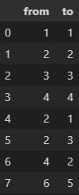
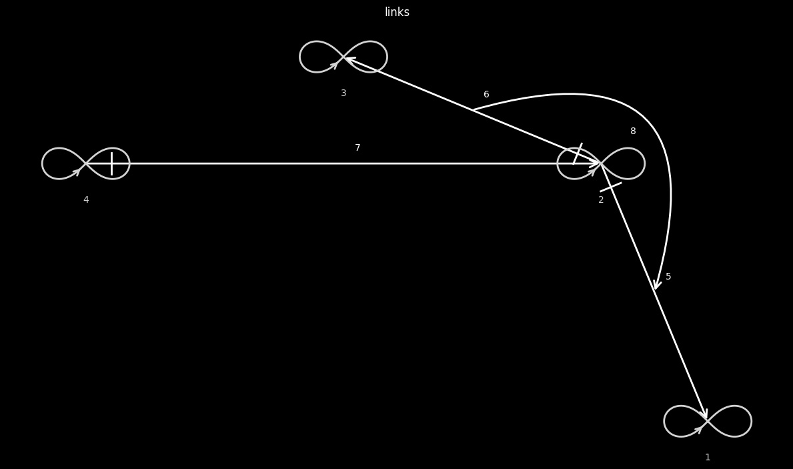

# links_doublet

The input is a sorted dataframe with links, as shown in the image below

  

Further with the task of necessary parameters such a connection for the table presented above is obtained

  

To clarify: the numbers mean the stage ID, i.e. dataframe ID +1. For example, the 1:1 closed link is executed first, here it is displayed as such, the 6:5 link is executed last (eighth). 

# How does the algorithm work? 

As I said above, the table should be sorted (you can sort by deeplinks library) in the format - first closed links, then links between closed links (they are defined as if they contain numbers that are in closed links), if there are no numbers that would be in closed links (in the example above it is 5:6), then it is a link between ID operations. 
The first thing we do is to draw closed links starting from the right, then from the left. Then we draw links between closed links and links between operations.

example - https://konard.github.io/links-visuals/H-fractal.html  
example - https://github.com/Konard/LinksPlatform/wiki/How-it-all-began

# Using the algorithm

You can use the algorithm using the deepvisual library (github.com/deep-foundation/deep-visual), also in ipynb of this repository is written an execution example with all visualization parameters